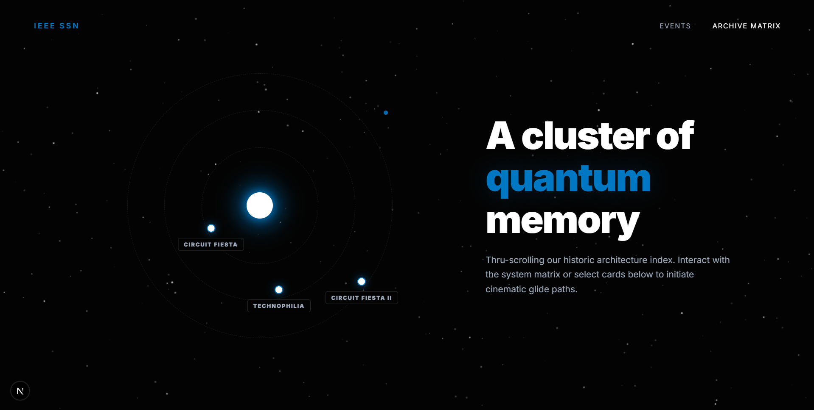
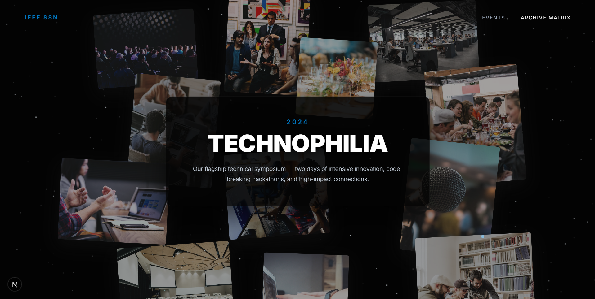

# IEEE SB SSN — Official Webpage ("Stellar")




The official webpage for the **IEEE Student Branch at SSN**, built as a modern, high-performance web application. Designed to be a living archive of innovation, it captures the events, people, and ideas that shape the chapter through deeply immersive UI/UX patterns.

## 🚀 Tech Stack
* **Framework:** Next.js (App Router)
* **Animations:** GSAP (GreenSock) + ScrollTrigger
* **Styling:** CSS Modules (Vanilla CSS for strict, predictable scoping)
* **Fonts:** Geist Sans (Optimized via `next/font`)

---

## ✨ Core Highlights & Architecture

### The "Chronicle" Gallery (`/gallery`)
The standout feature of the current build is the interactive `/gallery` route—a technically complex, highly animated photo archive. 

Rather than relying on a rigid grid or standard lightbox library, the gallery was custom-built with React and GSAP to simulate a dynamic, physical photo board:

* **"Controlled Chaos" Layout Structure**
  * Built using a custom Flexbox row system, images naturally wrap and stack across horizontal bands.
  * Precise offsets (`offsetX`, `offsetY`) and subtle CSS rotations (-5° to +5°) are applied to break the grid, creating natural edge-overlaps that feel like printed polaroids thrown on a table, without obscuring core content.

* **Cinematic Expansion (Popup View)**
  * The primary click interaction does not open a generic modal. Instead, it triggers a sequenced GSAP timeline:
    1. The underlying collage softly shrinks and blurs to simulate depth.
    2. A deep frosted glass backdrop (`rgba(0,0,0,0.4)` + `blur(12px)`) overlays the page.
    3. A faint radial cyan glow (`#00629b`) fades in directly behind the focal point.
    4. The selected image bounds into the center of the viewport (`ease: "bounce.out"`).
    5. A sleek, semi-transparent glass panel slides in from the bottom left, presenting the event title, year, and description.

* **Performance & GSAP Scoping**
  * Animations are strictly managed via the `@gsap/react` hook (`useGSAP`). 
  * All tweens and `ScrollTrigger` instances are scoped to specific `useRef` elements, guaranteeing cleanup on component unmount and preventing React state conflicts during navigation.
  * Scroll visibility issues (e.g., entrance animations conflicting with scroll animations) are handled via decoupled timelines and explicit `immediateRender: false` flags.

---

## 🛠️ Getting Started

First, run the development server:

```bash
npm run dev
# or
yarn dev
# or
pnpm dev
# or
bun dev
```

Open [http://localhost:3000](http://localhost:3000) with your browser to see the result.

### Project Structure
```text
/src
  /app
    /gallery
      page.tsx              # Core React component & GSAP logic for Chronicle
      gallery.module.css    # Strict scoped styling for the collage and cinematic popup
    page.tsx                # Main landing page
    layout.tsx              # Root layout & font injection
    globals.css             # Global color variables (--primary-blue, --bg-color, etc)
```

---

## 🎨 Design System & Colors
The project adheres to a specific aesthetic, blending clean modernism with deep, tech-focused blues.

* **Backgrounds:** `#f8f9fb` (Cream/White) and `#f2f4f6` (Collage Wrapper)
* **Typography:** `#191c1e` (Primary), `#414750` (Secondary)
* **Brand Accents:** `#004976` (Primary Blue) and `#00629b` (Cyan-Blue Highlight)
* **Glass/Frosted:** Heavily utilizes `backdrop-filter: blur()` combined with semi-transparent dark overlays.

---